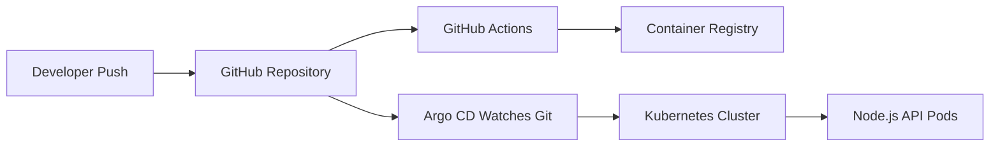

# GitOps Kubernetes Lab

A production-style GitOps deployment lab using Node.js, Docker, Kubernetes, Helm, GitHub Actions, and Argo CD.

## Why this project exists

This project demonstrates how modern cloud-native teams deploy applications using declarative configuration. Instead of clicking buttons in a cloud dashboard, the deployment state lives in Git.

## Architecture



## What is included

- Minimal Node.js API.
- Dockerfile.
- Helm chart.
- Kubernetes deployment/service/ingress/HPA templates.
- Argo CD Application manifest.
- GitHub Actions workflow to build and push a container image.

## Local app run

```bash
cd app
npm install
npm start
```

Open `http://localhost:3000`.
~
## Docker run

```bash
docker build -t gitops-kubernetes-lab ./app
docker run -p 3000:3000 gitops-kubernetes-lab
```

## Helm render test

```bash
helm template gitops-lab ./helm/gitops-kubernetes-lab
```

## Kubernetes deploy

```bash
helm upgrade --install gitops-lab ./helm/gitops-kubernetes-lab \
  --namespace gitops-lab \
  --create-namespace
```

## Argo CD example

Apply this manifest after installing Argo CD:

```bash
kubectl apply -f argocd/application.yaml
```

Before using it, update:

- `repoURL`
- image repository in `helm/gitops-kubernetes-lab/values.yaml`

## What this demonstrates

- Container image build workflow.
- Helm-based Kubernetes deployment.
- GitOps deployment model.
- Separation between app code and deployment config.
- Readable infrastructure documentation.
